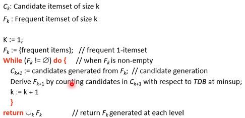

# 互评作业2: 频繁模式与关联规则挖掘
## 作业说明
1. 问题描述
> 本次作业中，将选择1个数据集进行频繁模式和关联规则挖掘。

2. 数据说明
> 数据集包括：
Consumer & Visitor Insights For Neighborhoods  
Wine Reviews  
Oakland Crime Statistics 2011 to 2016  
Chicago Building Violations  
Trending YouTube Video Statistics  
Melbourne Airbnb Open Data  
MLB Pitch Data 2015-2018  
与第一次互评作业的数据集范围是相同的，在选择的时候可以选择之前预处理的数据集，也可以重新选择一个。  

3. 数据分析要求
> 对数据集进行处理，转换成适合进行关联规则挖掘的形式；  
找出频繁模式； 
导出关联规则，计算其支持度和置信度;  
对规则进行评价，可使用Lift、卡方和其它教材中提及的指标, 至少2种；  
对挖掘结果进行分析；  
可视化展示。

4. 提交的内容
> 对数据集进行处理的代码  
关联规则挖掘的代码  
挖掘过程的报告：展示挖掘的过程、结果和你的分析  
所选择的数据集在README中说明，数据文件不要上传到Github中  

## 数据集 Oakland Crime Statistics 2011 to 2016
### Content
More details about each file are in the individual file descriptions.

### Context
This is a dataset hosted by the city of Oakland in California. The organization has an open data platform found here and they update their information according to the amount of data that is brought in. Explore Oakland's Data using Kaggle and all of the data sources available through the city of Oakland organization page!

+ Update Frequency: This dataset is updated daily.

### Acknowledgements
This dataset is maintained using Socrata's API and Kaggle's API. Socrata has assisted countless organizations with hosting their open data and has been an integral part of the process of bringing more data to the public.

This dataset is distributed under the following licenses: Open Data Commons Public Domain Dedication and License, NA

## 实现
### Apriori算法
Apriori 算法流程如下

### 关联规则
1. 支持度
$$Sup(x)=\frac{count(X)}{all_data}$$
2. 执行度
$$conf(X \to Y)=\frac{Sup(X \cup Y}{Sup(X)}$$
3. Lift
$$lift(X \to Y)=\frac{Sup(X \cup Y}{Sup(X) \times Sup(Y)}$$
4. Jaccard
$$Jaccard(X \to Y) = \frac{X \cup Y}{Sup(X) + Sup(Y) - Sup(X \cup Y)}$$

## 使用方法
参照fpaadm.ipynb, 实例化Association和OCS_dataset,然后调用OCS_dataset的mining方法即可。
